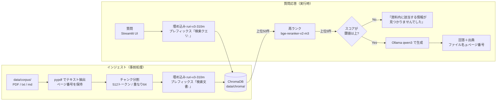

# local-rag-poc — 完全ローカル社内ナレッジRAGチャットボット（PoC）

外部クラウドにドキュメントを一切送信しない、**完全ローカル動作**の日本語RAGチャットボットの実証（PoC）です。
モデルの初回ダウンロード後は**機内モード（ネットワーク遮断）状態でも動作する**ことを要件としています。

技術的な狙いは次の3点です。

1. 外部クラウドにドキュメントを一切送信しない構成が成立することの実証
2. 日本語ドキュメントに対する検索精度を、2段検索（Embedding → Reranker）で確保できることの実証
3. 回答に**出典（ファイル名・ページ・該当箇所）を必ず添える**ことで、ハルシネーション対策と説明責任が担保できることの実証

> **絶対禁止事項**: 現職および過去の就業先の業務文書は一切取り込まないこと。
> 取り込み対象のルールは [data/corpus/README.md](data/corpus/README.md) を必ず読んでください。

---

## アーキテクチャ

全体像は以下の通りです（詳細な ingest / query の2フロー図と設計判断の根拠は [docs/architecture.md](docs/architecture.md) を参照）。



- **推論**: Ollama（`qwen3:8b`、GPU が無ければ `qwen3:4b` へ自動フォールバック）
- **埋め込み**: `cl-nagoya/ruri-v3-310m`（日本語特化）／ **再ランク**: `BAAI/bge-reranker-v2-m3`
- **ベクタDB**: ChromaDB（`data/chroma/` にローカル永続化）／ **UI**: Streamlit
- 設定値（Top-K・チャンクサイズ・閾値等）はすべて `src/config.py` に集約し、`.env` で上書きできます（`.env.example` 参照）

---

## セットアップ

「ゼロから30分以内の再現」を目標にした2ルートを用意しています。**所要時間の大半はモデルのダウンロード**（qwen3:4b 約2.6GB＋埋め込み/再ランクモデル約1.9GB）なので、回線が細い場合はそこだけ余裕を見てください。

前提（両ルート共通）:

- Windows 11 + WSL2（Ubuntu 24.04）を想定（他の Linux 環境でも同様に動作するはずですが未確認）
- Python 3.11 系（Ubuntu 24.04 はシステム Python への pip install がブロックされるため、**必ず venv を使用**。ルートBの手順に組み込み済み）
- GPU は任意。無ければ CPU-only で動作します（応答は遅くなります）

### ルートA: docker compose（Docker Desktop がある場合・推奨）

1. リポジトリを取得して移動します。
   ```bash
   git clone <このリポジトリのURL> local-rag-poc
   cd local-rag-poc
   ```
2. 起動します（初回はイメージビルド＋モデル自動取得のためネットワークが必要です）。
   ```bash
   docker compose up -d --build
   ```
   `ollama-init` コンテナが LLM モデル（既定 `qwen3:4b`）を自動取得します。進捗は `docker compose logs -f ollama-init` で確認できます。
3. ブラウザで http://localhost:8501 を開き、UI が表示されることを確認します（モデル取得中でも UI 自体は先に開けます）。
4. 取り込みたい資料（PDF / txt / md）を `data/corpus/` に置きます。**置いてよい資料の条件は [data/corpus/README.md](data/corpus/README.md) を必ず確認**してください。
5. インジェスト（ベクタDB構築）を実行します。初回は埋め込みモデルのダウンロードが走ります。
   ```bash
   docker compose exec app python -m src.ingest
   ```
6. ブラウザに戻って質問すると、回答と出典（ファイル名＋ページ番号）が表示されます。
7. （GPU がある場合のみ）`docker-compose.yml` の `deploy:` 節のコメントを外し、`OLLAMA_PULL_MODEL=qwen3:8b` を指定して起動し直すと `qwen3:8b` が使えます。手順の詳細は `docker-compose.yml` 内のコメントを参照してください。

### ルートB: WSL2 venv ＋ ネイティブ Ollama（Docker Desktop が無い場合）

1. 必要な OS パッケージを入れます。
   ```bash
   sudo apt update && sudo apt install -y python3 python3-venv make
   ```
2. Ollama をインストールし、サーバを起動します（インストーラがサービス登録しなかった場合は別ターミナルで `ollama serve` を実行したままにします）。
   ```bash
   curl -fsSL https://ollama.com/install.sh | sh
   ollama serve   # 既にサービスとして動いていればこの行は不要
   ```
3. リポジトリを取得して移動します。
   ```bash
   git clone <このリポジトリのURL> local-rag-poc
   cd local-rag-poc
   ```
4. venv 作成と依存インストールを行います。
   ```bash
   make setup
   ```
5. LLM モデルを取得します（初回のみ・要ネットワーク。8b/4b の両方を取得します。回線が細ければ `ollama pull qwen3:4b` だけでも可）。
   ```bash
   make pull-model
   ```
6. 取り込みたい資料を `data/corpus/` に置きます（[data/corpus/README.md](data/corpus/README.md) の条件を厳守）。
7. インジェストを実行します（初回は埋め込み・再ランクモデルのダウンロードが走ります）。
   ```bash
   make ingest
   ```
8. UI を起動し、ブラウザで http://localhost:8501 を開きます。
   ```bash
   make run
   ```

---

## 機内モード動作の確認手順

「外部にデータを送らない」ことをデモで示すための手順です。**ネットワークが必要なのはモデルの初回ダウンロードのみ**という設計を、実際に遮断して確認します。

1. 上記セットアップを最後まで完了させます（`make ingest` / `docker compose exec app python -m src.ingest` まで）。
2. オンラインのまま UI で1問質問し、回答が返ることを確認します（これで LLM・埋め込み・再ランクの全モデルがローカルキャッシュに揃ったことが保証されます）。
3. Windows の**機内モードを ON** にします（有線接続の場合はケーブルも抜きます）。
4. UI で**新しい質問**を投げ、回答と出典が表示されることを確認します。
5. 「資料に記載がない質問」も投げ、『資料内に該当する情報が見つかりませんでした』が返ることを確認します。

補足:

- docker compose ルートではコンテナ間通信（app ↔ ollama）は内部ネットワークなので、ホストの機内モードの影響を受けません。
- 遮断状態で HuggingFace への接続確認のリトライ待ちが起きてモデルロードが遅い場合は、環境変数 `HF_HUB_OFFLINE=1` を設定するとローカルキャッシュのみを参照するようになります。

---

## 使い方

```bash
# 1. 資料を配置（条件は data/corpus/README.md）
cp ~/my-study-notes/*.pdf data/corpus/

# 2. 取り込み（資料を追加・削除・差し替えたら再実行。DBは作り直されます）
make ingest        # docker の場合: docker compose exec app python -m src.ingest

# 3. UI で対話
make run           # docker の場合: docker compose up -d 済みなら http://localhost:8501 へ

# 4. 評価（golden_set.yaml を実 corpus に合わせて記入してから）
make eval          # docker の場合: docker compose exec app python -m eval.run_eval
```

各モジュールは単体でも実行できます（デバッグ・面接デモでの説明用）。

```bash
python -m src.config              # 現在の設定値と GPU 判定・使用モデルの確認
python -m src.ingest              # 取り込みのみ
python -m src.retrieve "質問文"   # 2段検索の結果（file / page / score）だけを確認
python -m src.generate "質問文"   # 回答＋出典＋所要時間を CLI で確認
```

チャンクサイズ・Top-K・拒否閾値などのパラメータは `.env` で変更できます（`cp .env.example .env` して編集）。チャンク関係を変えたら `make clean-db` → `make ingest` で DB を作り直してください。

---

## 評価

### golden_set.yaml の書き方

`eval/golden_set.yaml` に「回答可能20問」と「資料に記載がない5問」を記入します。

```yaml
answerable:            # 回答可能 20 問
  - id: q01
    question: "質問文"
    expected_sources:
      - file: "corpus内のファイル名"   # パスではなくファイル名のみ
        page: 3                        # 任意。省略時はファイル一致のみで判定
unanswerable:          # 拒否が正解の 5 問
  - id: u01
    question: "資料に載っていないことへの質問"
```

> **現状はプレースホルダです。** corpus 題材が確定していないため（後述の「確認事項」参照）、電験二種学習資料を想定したテンプレート問題が入っています。corpus 確定後、実際のファイル名・ページ番号に合わせて全問を差し替えてください（一致しないと Recall@5 が常に 0 になります）。

### 実行と出力

`make eval`（または `python -m eval.run_eval`）で、1問1行の詳細 CSV とサマリ CSV が `eval/results/` に出力され、受入基準との照合結果が標準出力に表示されます。

### 評価結果

**TBD** — corpus 確定・golden_set 差し替え後に測定し、この表に記入します。

| 指標 | 受入基準 | 結果 |
|---|---|---|
| Recall@5（正解文書が Top-5 に入る率） | 80% 以上 | TBD |
| 拒否精度（記載なし5問中、正しく拒否した数） | 4/5 以上 | TBD |
| 平均応答時間（CPU-only） | 60 秒以内 | TBD |
| 平均応答時間の内訳（検索 / 生成） | −（参考） | TBD |
| 最大応答時間 | −（参考。180秒超は撤退基準） | TBD |
| 使用モデル / 実行環境（CPU or GPU 型番） | − | TBD |

---

## コスト比較

| 方式 | 初期 | 月額 | 情報漏洩リスク | 備考 |
|---|---|---|---|---|
| 本PoC（完全ローカル・CPU） | 0円（既存PC） | 0円 | なし | 応答は遅い |
| 完全ローカル（GPU増設 RTX3060級） | 約4〜5万円 | 電気代のみ | なし | 実用速度 |
| 外部API利用（クラウドLLM） | 0円 | 従量課金 | **あり（文書を外部送信）** | 装置メーカーでは採用困難 |
| 手作業での資料検索 | 0円 | 人件費 | なし | 先行事例では検索工数70%削減の報告あり |

**結論**: 機密文書を扱う前提では、外部API方式は初期コストの安さに関わらず選択肢に入らない。ローカル方式の比較軸は「速度 vs GPU投資」に絞られる。

---

## 既知の限界

正直に書きます。面接・レビューで突っ込まれる前提の項目です。

- **長文要約は苦手**: 検索は Top-5 チャンク（各512トークン）しか LLM に渡さないため、「この資料全体を要約して」のような質問は資料の一部しか反映できず精度が落ちます。本PoCは「ピンポイントの質問に出典付きで答える」用途に最適化しています。
- **表・数式の解析限界**: PDF の表はテキスト抽出時にレイアウトが崩れることがあります（pypdf で崩れた場合は pdfplumber にフォールバックしますが、複雑な表・数式・図は正しく読めないことがあります）。画像・図面の読解（マルチモーダル）はスコープ外です。
- **軽量モデルのフォーマット指示無視**: qwen3 の軽量モデルは「該当がなければ拒否」「出典を列挙」といったプロンプト指示を無視することが報告されています。このため**拒否判定と出典構築はプロンプトに任せず、コード側で行っています**（詳細は [docs/architecture.md](docs/architecture.md)）。それでも回答本文の言い回し自体は揺れます。
- **チャンク分割によるコンテキスト分断**: 512トークン境界で説明が分断され、前提と結論が別チャンクに割れることがあります。オーバーラップ64トークンで緩和していますが、根絶はできません。
- **拒否判定は閾値依存**: 再ランクスコア閾値（既定 `RERANK_SCORE_THRESHOLD=0.30`）はコーパスの性質によって最適値が変わるため、題材確定後に調整が必要になる可能性があります。
- **初回のみネットワークが必要**: モデルのダウンロード（Ollama / HuggingFace）に一度だけ接続が必要です。完全オフラインでの初期構築（USBメディア等での持ち込み）は本PoCでは未対応です。
- **CPU-only は遅い**: 1問あたり最大60秒程度かかります（受入基準内ですが体感は「待つ」速度です）。実用化には GPU 投資が現実的です（コスト比較参照）。
- **マルチユーザー・認証・権限制御なし**: 本番要件であって PoC 要件ではないため対象外です。

---

## 確認事項（利用者の回答待ち）

以下の3点は**実装側で勝手に確定できないため、利用者（シンクウさん）の確認待ち**です。現状は「無い側」に倒した安全な既定で動きます。

1. **GPU の有無と型番**（RTX系の有無・VRAM容量）
   → 未確認のため CPU-only を既定とし、GPU があれば自動で使う実装になっています（`python -m src.config` で判定結果を確認できます）。
2. **corpus に入れる題材の確定**（候補: 電験二種の自作学習資料 / 公開技術資料。**現職の業務文書は不可**）
   → 未確定のため `eval/golden_set.yaml` はプレースホルダのままです。題材確定後に差し替えてください。
3. **Docker Desktop のインストール有無**
   → 有ればルートA（docker compose）、無ければルートB（Makefile ＋ ネイティブ Ollama）を使ってください。両ルートとも整備済みです。

---

## ライセンス

使用している OSS・モデルのライセンス一覧は [THIRD_PARTY_LICENSES.md](THIRD_PARTY_LICENSES.md) を参照してください。

## ディレクトリ構成

```
local-rag-poc/
├── README.md                 # 本ファイル
├── THIRD_PARTY_LICENSES.md   # 使用 OSS・モデルのライセンス一覧
├── docker-compose.yml        # ルートA（ollama + app）
├── Dockerfile
├── Makefile                  # ルートB（Docker 無し環境向け）
├── requirements.txt
├── .env.example              # 設定の上書き例（秘密情報は置かない）
├── data/
│   ├── corpus/               # 取り込み対象（git 管理外。README.md 必読）
│   └── chroma/               # ベクタDB永続化（git 管理外）
├── src/
│   ├── config.py             # 設定の一元管理（マジックナンバー禁止）
│   ├── ingest.py             # 取り込み・チャンク分割・ベクトル化
│   ├── retrieve.py           # 2段検索（embedding → rerank）
│   ├── generate.py           # Ollama 呼び出し・拒否判定・出典整形
│   └── app.py                # Streamlit UI
├── eval/
│   ├── golden_set.yaml       # 評価用 20+5 問（現状プレースホルダ）
│   └── run_eval.py           # Recall@5・拒否率・応答時間の測定と CSV 出力
└── docs/
    └── architecture.md       # 構成図（Mermaid）と設計判断の根拠
```
