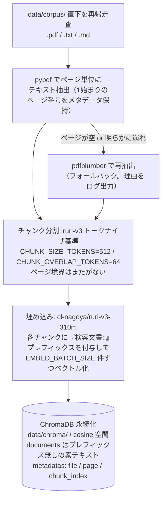
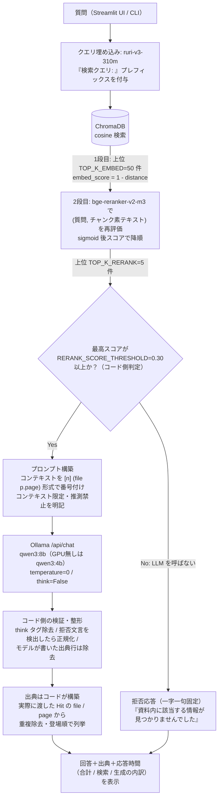

# アーキテクチャと設計判断の根拠

本書は「どこで精度が決まるか」を自分の言葉で説明するための文書です。構成図（ingest / query の2フロー）と、主要な設計判断の「なぜ」をまとめます。パラメータの既定値はすべて `src/config.py` に集約されており、`.env` で上書きできます。

---

## 1. ingest フロー（`python -m src.ingest`）

- ページ番号を最初から最後まで持ち回るのは、**出典表示（ファイル名＋ページ番号）が本PoCの中核要件**であり、後段で復元できないため。
- 再実行時は既存コレクションを削除して作り直します。PoC では差分更新の複雑さより「DB と corpus が必ず一致している」確実性を優先しています。

## 2. query フロー（UI / `python -m src.generate "質問文"`）

---

## 3. 設計判断の根拠

### 3-1. なぜ2段検索（Embedding → Reranker）にしたか

| | 1段目: bi-encoder（ruri-v3） | 2段目: cross-encoder（bge-reranker-v2-m3） |
|---|---|---|
| 仕組み | 質問と文書を**別々に**ベクトル化し、cosine 類似度で比較 | 質問と文書を**連結して1つのモデルに入れ**、関連度を直接推定 |
| 速度 | 速い（文書側は事前計算済み。実行時はクエリ1本の埋め込みのみ） | 遅い（候補件数ぶんモデルを回す） |
| 精度 | 粗い（意味の近さは拾うが、質問と文書の細かい対応関係は見ない） | 高い（語と語の対応まで見るため、言い換え・部分一致に強い） |

日本語の技術文書は言い換え・表記揺れ（「電界/電場」「共振/同調」など）が多く、埋め込み1段だけでは正解文書が上位5件から漏れやすい。かといって cross-encoder を全チャンクに回すと実行時間が破綻する。そこで**「速いが粗い網で50件（`TOP_K_EMBED`）に絞り、遅いが正確な目で5件（`TOP_K_RERANK`）を選ぶ」**役割分担にした。Recall@5 ≥ 80% という受入基準を CPU-only の時間制約（60秒/問）の中で狙うための構成である。

副次効果として、2段目のスコア（0〜1 に正規化される）が**拒否判定の判断材料**として使える（3-3 参照）。1段目の cosine 類似度は「相対的にどれが近いか」しか示さず、絶対値での足切りに向かない。

### 3-2. ruri プレフィックス（「検索クエリ: 」「検索文書: 」）の意味

ruri-v3 は**プレフィックス方式で学習されたモデル**であり、入力テキストの先頭に用途を表すプレフィックスを付ける前提で埋め込み空間が作られている。検索用途では質問側に「検索クエリ: 」、文書側に「検索文書: 」を付ける。これを省くと「質問文と文書文が同じ空間の同じ場所に来るべきか」の手がかりをモデルが失い、**検索精度が大きく落ちる**（モデルカードに記載の使用条件）。

一方で、プレフィックスは**埋め込み計算のときだけ**付ける。

- ChromaDB の documents には**素のテキスト**を保存する（表示・再ランクで使うのは本文そのものだから）。
- reranker への入力にもプレフィックスは付けない。bge-reranker-v2-m3 は ruri のプレフィックス方式で学習されておらず、付けると単なるノイズになる。

「どこでプレフィックスを付け、どこで外すか」は本構成の精度を左右するポイントの一つなので、`config.py` に `EMBED_QUERY_PREFIX` / `EMBED_DOC_PREFIX` として明示的に定義している。

### 3-3. 拒否判定をコード側の閾値にした理由

「資料に記載がない質問には推測せず拒否する」はプロンプトでも指示しているが、**プロンプトだけに任せない**。軽量モデルが「無ければ拒否」の指示を無視して一般知識で答えてしまう事例が報告されているためである（指示文書 §10 Phase 4 注記）。

そこで、再ランク後の**全ヒットのスコアが `RERANK_SCORE_THRESHOLD`（既定 0.30）未満なら、LLM を呼ばずにコード側で拒否**を確定する。この方式の利点は3つ。

1. **決定的**: 同じ質問には必ず同じ拒否判定になる。LLM の気分（サンプリング）に依存しない。評価（拒否率 4/5 以上）の再現性が担保される。
2. **速い**: 拒否ケースで LLM 生成をスキップできるため、応答が数秒で返る。
3. **説明可能**: 「スコア 0.12 < 閾値 0.30 だから拒否」と数値で説明できる。面接デモで「なぜ答えなかったか」を示せる。

なお LLM が自発的に拒否文言を出した場合も、コード側で `config.REFUSAL_MESSAGE` の一字一句に正規化する（文言が揺れると評価スクリプトの拒否判定が壊れるため）。閾値 0.30 は sigmoid 後スコアの「無関係文書はほぼ 0 付近、関連文書は 0.5 超に分布しやすい」性質を踏まえた初期値で、corpus 確定後に誤拒否/誤回答のバランスを見て調整する。

### 3-4. 出典をコード側で構築する理由

プロンプトでは「末尾にファイル名 p.ページ番号を列挙せよ」と指示するが、**表示する出典はモデルの出力から取らない**。理由は、モデルが出典を捏造しうるからである（存在しないページ番号、渡していないファイル名を書く事例がある）。捏造出典を1回でも表示したら「出典で説明責任を担保する」という本PoCの核心が崩れる。

そのため:

1. モデルが本文中・末尾に書いた出典行はコード側で**除去**する。
2. 表示する出典は、**実際に LLM へ渡した検索ヒット（Hit）の file / page からコードが構築**する（重複除去・登場順）。

つまり出典は「モデルの申告」ではなく「システムが実際に何を渡したかの記録」である。UI ではさらに各出典から該当チャンク全文を展開でき、利用者が原文と突き合わせて検証できる。

### 3-5. チャンク 512トークン / オーバーラップ 64 の根拠と調整方針

初期値（`CHUNK_SIZE_TOKENS=512` / `CHUNK_OVERLAP_TOKENS=64`）の根拠:

- **512トークン**は技術文書の「1つの話題のまとまり（節〜数段落）」に相当する。小さすぎる（例: 128）と文脈が切れて埋め込みが断片的な意味しか持てず、大きすぎる（例: 2048）と1ベクトルに複数話題が混ざって検索が鈍り、かつ LLM コンテキスト（`OLLAMA_NUM_CTX=8192`）に上位5件を収める余裕が減る。
- トークン数は**埋め込みモデル（ruri-v3）のトークナイザ基準**で数える。埋め込み時の入力上限と直結する単位で管理するためで、文字数基準だと日本語/英語混在文書でチャンクの実効サイズがぶれる。
- **オーバーラップ64（12.5%）**は、チャンク境界で文が分断されたとき、少なくとも片側のチャンクに前後の文脈が残るようにする保険。大きくしすぎるとチャンク数（＝DB サイズと1段目検索の母集団）が無駄に増える。
- **ページ境界はまたがない**。またぐと「このチャンクは何ページか」が曖昧になり、出典のページ番号表示が成立しなくなるため。精度よりも出典の正確さを優先した判断である。

**Recall@5 が低い場合の調整順序**（指示文書 §7: パラメータ調整は3回まで。3回で 60% 未満なら撤退）:

| 順 | 調整対象 | 動かし方の例 | 先に動かす理由 |
|---|---|---|---|
| 1 | チャンクサイズ | 512 → 256（細かい事実の取り逃し時）または 768（文脈分断が目立つ時） | 検索単位の「意味の密度」を決める最上流のパラメータで、影響が最も大きい |
| 2 | オーバーラップ | 64 → 128 | 境界分断という特定の失敗モードだけを狙って緩和できる |
| 3 | Top-K | `TOP_K_EMBED` 50 → 100 | 1段目の取り逃しを広い網で救う最後の手段。増やすほど再ランクが遅くなるため最後 |

チャンク関係を変えた場合はベクタDBの作り直し（`make clean-db` → `make ingest`）が必要。調整のたびに `make eval` で Recall@5 を測り、変更・結果・判断を記録する（撤退基準の「3回」を数えるため）。

---

## 4. その他の判断（要点のみ）

- **temperature=0**: 出典に基づく事実回答に創造性は不要。再現性を優先。
- **`think=False` ＋ think タグの正規表現除去の二重防御**: qwen3 は思考タグを出力する系のモデルで、古い Ollama では `think` パラメータが無視されるため、コード側でも除去する。
- **ChromaDB / cosine 空間**: ローカル永続化が1ファイル構成で済み、PoC の「単一コマンド起動」「機内モード動作」と相性が良い。cosine は正規化済み埋め込みの標準的な距離で、`embed_score = 1 - distance` として直感的なスコアに変換できる。
- **GPU 自動判定**: CPU-only で完走する構成を既定とし、CUDA が使えれば埋め込み/再ランクは自動で GPU を使い、LLM も `qwen3:8b` に切り替わる（`config.has_gpu()` / `config.resolve_ollama_model()`）。環境確認は `python -m src.config`。
